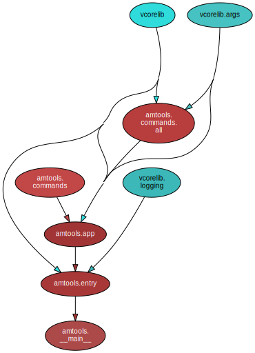

<!--
    =====================================
    generator=datazen
    version=3.1.4
    hash=6b0f9b02df3fb65c066f54afd0083631
    =====================================
-->

# amtools ([0.1.0](https://pypi.org/project/amtools/))

[](https://pypi.org/project/amtools/)

[](https://codecov.io/github/mmbrea/amtools)


*amber's tools*

## Documentation

### Generated

* By [sphinx-apidoc](https://mmbrea.github.io/python/sphinx/amtools)
(What's [`sphinx-apidoc`](https://www.sphinx-doc.org/en/master/man/sphinx-apidoc.html)?)
* By [pydoc](https://mmbrea.github.io/python/pydoc/amtools.html)
(What's [`pydoc`](https://docs.python.org/3/library/pydoc.html)?)

## Python Version Support

This package is tested with the following Python minor versions:

* [`python3.8`](https://docs.python.org/3.8/)
* [`python3.9`](https://docs.python.org/3.9/)
* [`python3.10`](https://docs.python.org/3.10/)
* [`python3.11`](https://docs.python.org/3.11/)

## Platform Support

This package is tested on the following platforms:

* `ubuntu-latest`
* `macos-latest`
* `windows-latest`

# Introduction

# Command-line Options

```
$ ./venv3.11/bin/amtools -h

ArgumentParser(prog='amtools pdf', usage=None, description=None, formatter_class=<class 'argparse.HelpFormatter'>, conflict_handler='error', add_help=True)
usage: amtools [-h] [--version] [-v] [-q] [--curses] [--no-uvloop] [-C DIR]
               {pdf,noop} ...

amber's tools

options:
  -h, --help         show this help message and exit
  --version          show program's version number and exit
  -v, --verbose      set to increase logging verbosity
  -q, --quiet        set to reduce output
  --curses           whether or not to use curses.wrapper when starting
  --no-uvloop        whether or not to disable uvloop as event loop driver
  -C DIR, --dir DIR  execute from a specific directory

commands:
  {pdf,noop}         set of available commands
    pdf              Dissecting PDFs
    noop             command stub (does nothing)

```

# Internal Dependency Graph

A coarse view of the internal structure and scale of
`amtools`'s source.
Generated using [pydeps](https://github.com/thebjorn/pydeps) (via
`mk python-deps`).


